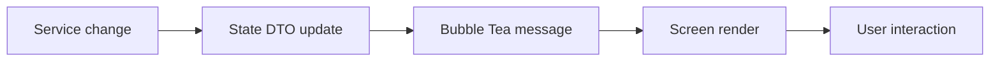

# Developer Guide

## Workspace Layout
- `cmd/`: Cobra entrypoints
- `internal/tui/`: Bubble Tea app shell
- `internal/screens/`: presentation-only screen renderers
- `internal/ui/`: theme, layout, modal, palette, and key bindings
- `internal/state/`: DTOs and shared application state
- `internal/services/`: config, logging, runtime telemetry, cleanup, uninstall, optimize, and purge services
- `pkg/util/`: formatting, fuzzy matching, and sparkline helpers

## Local Development
1. `go test ./...`
2. `go vet ./...`
3. `gofmt -w main.go cmd internal pkg`
4. `go build -o bin/winmole.exe .`

## Extending Screens
1. Add new state fields in `internal/state`.
2. Add or update a service in `internal/services`.
3. Sync Bubble components in `internal/tui/model.go`.
4. Route messages and key handling in `internal/tui/update.go`.
5. Render the new UI in `internal/screens`.

## Runtime Logging
- All user-visible task output is written through `services.Logger`.
- The Logs screen reads from the in-memory log buffer and file-backed logger.
- Long-running operations should return Bubble Tea messages instead of mutating UI state directly.

## Release Flow
- Use `make build-windows-amd64` and `make build-windows-arm64` for manual builds.
- Use GoReleaser for distributable zip archives.

