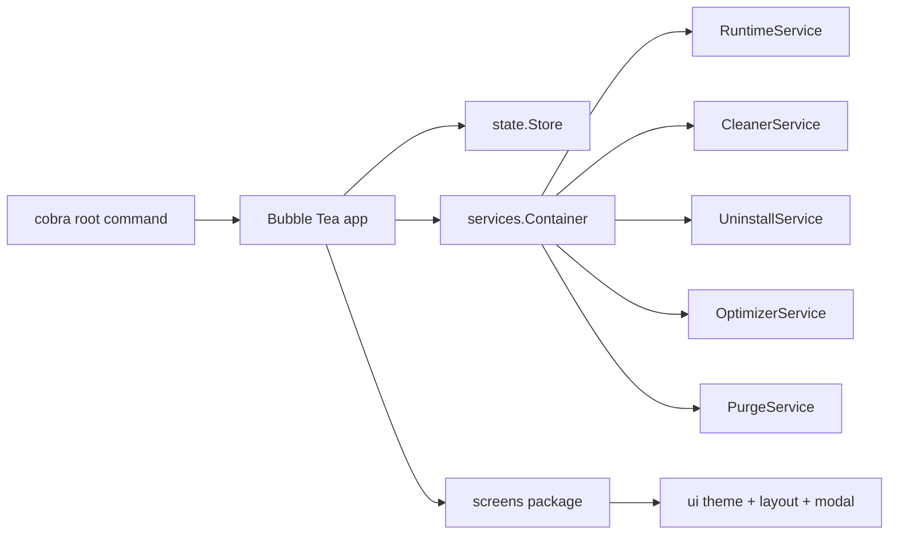
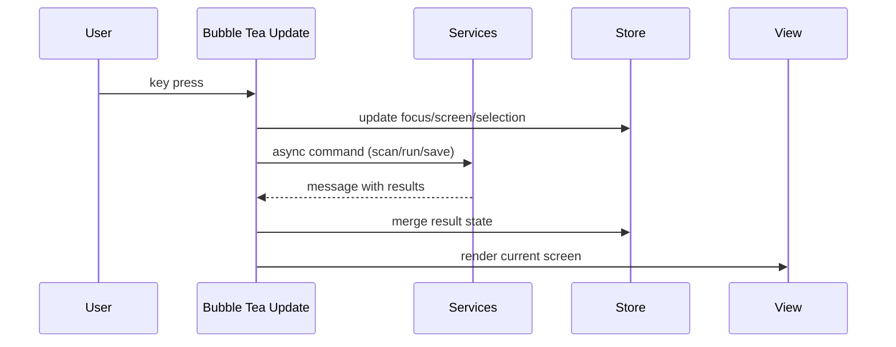

# TUI Architecture

## Overview
Winmole is now a single Bubble Tea application with a Cobra entrypoint, shared runtime services, and screen-specific state rendered through a common Lip Gloss theme.

## State Model
- `state.Store` holds the current screen, focus area, runtime snapshot, inventories, selected project, action pane, help docs, logs, palette state, and modal state.
- `internal/tui` owns Bubble Tea models such as lists, text inputs, spinner, and viewports.
- Services return plain state DTOs rather than rendering directly.

## Event Flow

## Screen Responsibilities
- `Dashboard`: live system overview, health, quick commands, alerts
- `Projects`: project discovery, analyzer view, artifact selection and purge
- `Actions`: deep clean, uninstall, optimize catalogs
- `Logs`: searchable runtime event stream
- `Settings`: editable scan paths and runtime config
- `Help`: markdown documentation rendered through Glamour
