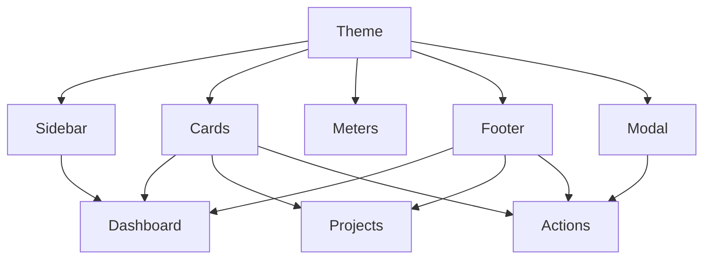

# UI Components

## Design System
- Theme file: `internal/ui/theme.go`
- Layout calculations: `internal/ui/layout.go`
- Reusable cards, meters, badges, tabs, footer: `internal/ui/components.go`
- Modal and command palette containers: `internal/ui/modal.go`, `internal/ui/palette.go`
- Shared key bindings: `internal/ui/keymap.go`

## Core Components
- Sidebar navigation with focused item highlighting
- Card-based content panels for status, settings, and summaries
- Meter rows for CPU, memory, disk, and analyzer usage bars
- Bubble list views for projects, artifacts, clean targets, apps, tasks, settings, and docs
- Viewport-based logs and help document panes
- Reusable modal system for confirmations, text input, and alerts
- Command palette with fuzzy filtering and action execution

## Component Relationships

## Windows UX Notes
- Rounded borders and ANSI colors are selected to render cleanly in Windows Terminal, PowerShell, CMD, and WezTerm.
- The app uses a single alt-screen Bubble Tea session instead of jumping between subprocess TUIs.
- The status bar keeps keyboard hints visible so the UX stays discoverable even in narrow terminals.
